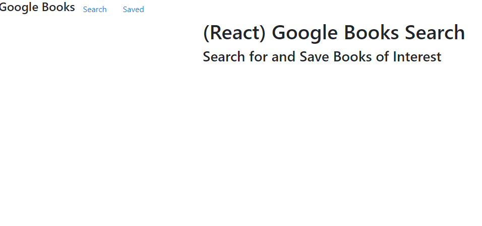

# Google Books Search

In the terminal, perform the following steps:
1. 'npm install'
2. 'npm run start'

## Description
This app is for users who love books and want to search and save their favorites or explore other books they have yet to discover. Users can click on the nav to direct them to their saved books. 

Heroku URL: https://w125-google-books-search.herokuapp.com/

GitHUB Repo: https://github.com/wilbur125/Google_Books_Search 

